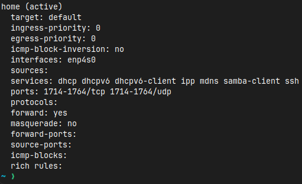
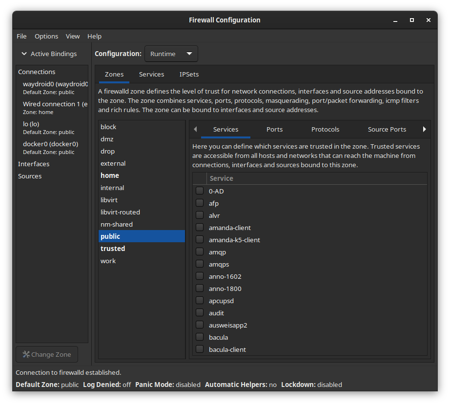
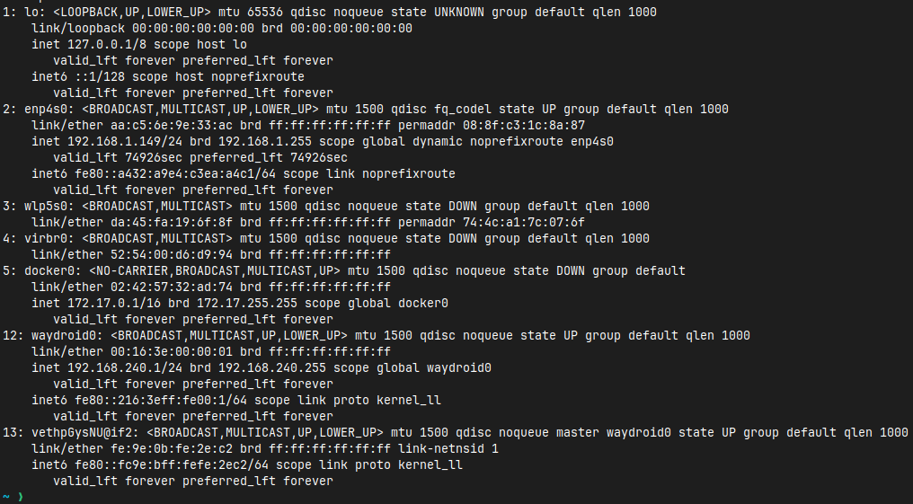
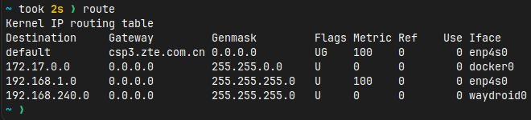
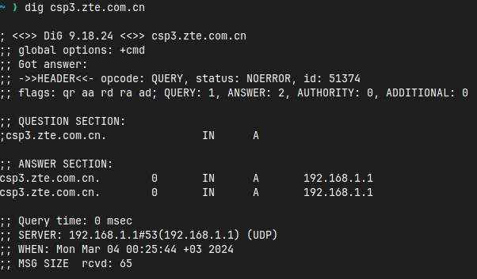
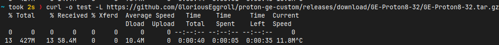
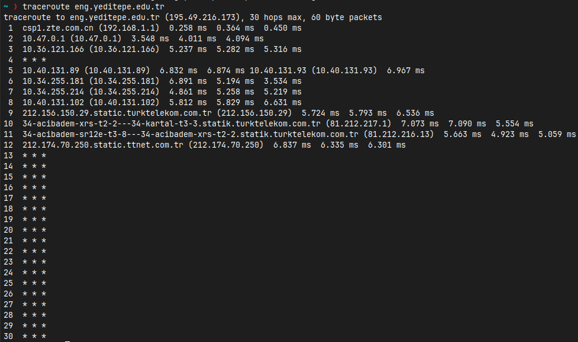

# Lab 1

| Command | Description | Image |
| --- | --- | ---|
| ss | s a linux utility for investigating system sockets the given output provides the tcp, udp, listening, raw sockets with pure ip address without solving them |  |
| firewall-cmd | Configuration tool for firewalld for my pc |  |
| firewall-config | GUI Configuration for the firewall |  |
| netstat | Is the old deprecated tool from net-tools package, replaced by ss | |
| ip | Shows and manipulates the present network devices and interfaces |  |
| route | Show and manipulate kernel routing table |  |
| dig | DNS lookup for the given adress |  |
| curl | Transfer data to or from a server |  |
| traceroute | Print the route to given host |  |
