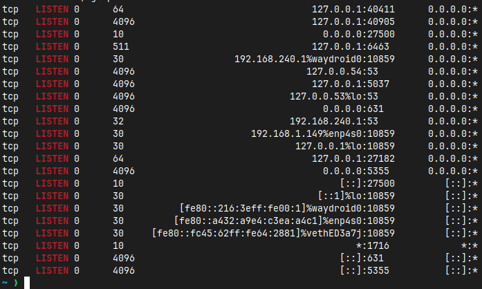

# Lab 1

| Command | Description | Image |
| --- | --- | ---|
| ss | s a linux utility for investigating system sockets the given output provides the tcp, udp, listening, raw sockets with pure ip address without solving them | 
